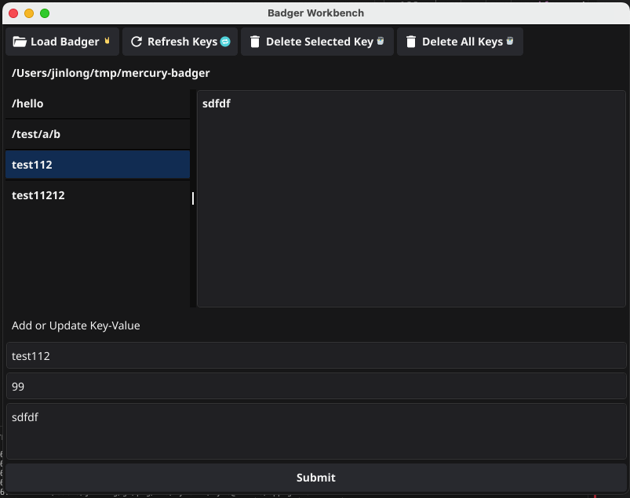

# Badger Workbench

Badger Workbench is a graphical user interface (GUI) application built with [Fyne](https://fyne.io/) for managing a [BadgerDB](https://dgraph.io/badger) database. It allows users to interact with key-value pairs in the database, including adding, updating, deleting, and viewing keys and their values.

## Features

- **Load Database**: Open a BadgerDB directory to interact with the database.
- **View Keys**: Display all keys stored in the database.
- **Add/Update Key-Value Pairs**: Add new key-value pairs or update existing ones.
- **Set TTL**: Specify a time-to-live (TTL) for keys.
- **Delete Keys**:
  - Delete a selected key.
  - Delete all keys in the database.
- **View TTL**: Display the remaining TTL for keys.
- **Dark Theme**: The application uses a dark theme for better readability.

## Installation

### Option 1: Download Precompiled Binaries

1. Go to the [Releases](https://github.com/jin06/badger-workbench/releases) page.
2. Download the appropriate binary for your platform:
   - macOS: `BadgerWorkbench-<version>-darwin-amd64` or `BadgerWorkbench-<version>-darwin-arm64`
   - Windows: `BadgerWorkbench-<version>-windows-amd64.exe` or `BadgerWorkbench-<version>-windows-386.exe`
   - Linux: `BadgerWorkbench-<version>-linux-amd64` or `BadgerWorkbench-<version>-linux-arm64`
3. Make the binary executable (if required):
   - On macOS/Linux:
     ```bash
     chmod +x BadgerWorkbench-<version>-<platform>
     ```
4. Run the application:
   - On macOS/Linux:
     ```bash
     ./BadgerWorkbench-<version>-<platform>
     ```
   - On Windows:
     Double-click the `.exe` file.

### Option 2: Build from Source

1. Clone the repository:
   ```bash
   git clone https://github.com/jin06/badger-workbench.git
   cd badger-workbench
   ```

2. Install dependencies:
   ```bash
   go mod tidy
   ```

3. Run the application:
   ```bash
   go run main.go
   ```

## Usage

1. **Load Database**: Click the "Load Badger 🤘" button to select a BadgerDB directory.
2. **View Keys**: Keys will be displayed in the list on the left.
3. **Add/Update Key-Value**:
   - Enter a key in the "Enter Key" field.
   - Enter a value in the "Enter Value" field.
   - Optionally, specify a TTL in seconds in the "Enter TTL (seconds)" field.
   - Click "Submit" to save the key-value pair.
4. **Delete Keys**:
   - To delete a selected key, click "Delete Selected Key 🗑️".
   - To delete all keys, click "Delete All Keys 🗑️".
5. **Refresh Keys**: Click "Refresh Keys 🔁" to reload the key list.

## Project Structure

```
badger-workbench/
├── main.go          # Entry point of the application
├── ui.go            # UI setup and event handling
├── db.go            # Database operations (BadgerDB)
├── README.md        # Project documentation
├── doc/             # Documentation assets (e.g., screenshots)
```

## Screenshots

### Main Interface


## License

This project is licensed under the MIT License. See the [LICENSE](LICENSE) file for details.

## Acknowledgments

- [Fyne](https://fyne.io/) for the GUI framework.
- [BadgerDB](https://dgraph.io/badger) for the key-value database.